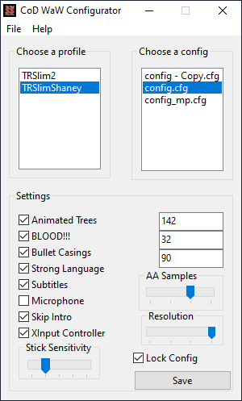

# wawconfig

This is a configurator for some of Call of Duty: World at War's settings which are not adjustable via the in-game menus.
Call of Duty and Call of Duty: World at War are registered trademarks of Activision and have no affiliation or endorsement of this project.

The program is written in Free Pascal using Lazarus targeting Win32.
